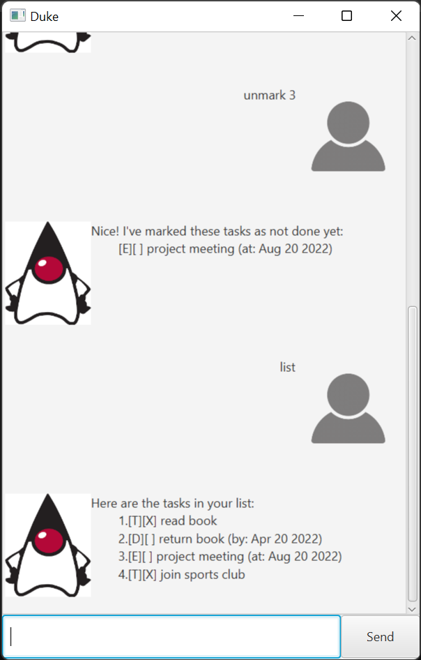

# User Guide

Duke is a **desktop app for managing tasks, optimised for use via a Command Line Interface** (CLI).

Table of Contents:
- [Quick Start](#quick-start)
- [Features](#features)
- [Command Summary](#command-summary)

## Quick Start

1. Ensure you have Java `11` or above installed in your Computer.

2. Download the latest `duke.jar` from [here](https://github.com/neosunhan/ip/releases).

3. Copy the file to the folder you want to use as the home folder for Duke. Your data will be stored here.

4. Double-click the file to start the app. The GUI similar to the below should appear in a few seconds.


5. Type the command in the command box and press Enter to execute it.

6. Refer to the [Features](#features) below for details of each command.

## Features

### Listing all tasks: `list`

Shows a list of all tasks.

Format: `list`

Example outcome:
```
Here are the tasks in your list:
    1.[T][X] read book
    2.[D][ ] return book (by: Apr 20 2022)
```

### Adding a Todo: `todo`

Adds a task.

Format: `todo DESCRIPTION`

Example of usage:
- `todo read book`

Example outcome:
```
Got it. I've added this task:
    [T][ ] read book
Now you have 2 tasks in the list.
```

### Adding a Deadline: `deadline`

Adds a task with a specified deadline.

Format: `deadline DESCRIPTION /by DATE`
- `DATE` must be in the format `YYYY-MM-DD`.

Example of usage:
- `deadline return book /by 2022-04-20`

Example outcome:
```
Got it. I've added this task:
    [D][ ] return book (by: Apr 20 2022)
Now you have 2 tasks in the list.
```

### Adding an Event: `event`

Adds a task happening on a specified date.

Format: `event DESCRIPTION /at DATE`
- `DATE` must be in the format `YYYY-MM-DD`.

Example of usage:
- `event project meeting /at 2022-08-20`

Example outcome:
```
Got it. I've added this task:
    [E][ ] project meeting (at: Aug 20 2022)
Now you have 2 tasks in the list.
```

### Marking tasks as done: `mark`

Marks specified tasks as done.

Format: `mark TASK_INDEX [TASK_INDICES]`
- Marks the task at the specified `TASK_INDEX` as done.
- The index refers to the index number shown in the displayed task list.
- The index **must be a positive integer** 1, 2, 3, ...
- Additional indices separated by whitespace can be specified. All tasks at the specified indices will be marked as done.

Example of usage:
- `mark 2 3`

Example outcome:
```
Nice! I've marked these tasks as done:
    [D][X] return book (by: Apr 20 2022)
    [E][X] project meeting (at: Aug 20 2022)
Now you have 2 tasks in the list.
```

### Marking tasks as not done: `unmark`

Marks specified tasks as not done.

Format: `unmark TASK_INDEX [TASK_INDICES]`
- Marks the task at the specified `TASK_INDEX` as not done.
- The index refers to the index number shown in the displayed task list.
- The index **must be a positive integer** 1, 2, 3, ...
- Additional indices separated by whitespace can be specified. All tasks at the specified indices will be marked as not done.

Example of usage:
- `unmark 2 3`

Example outcome:
```
Nice! I've marked these tasks as not done yet:
    [D][ ] return book (by: Apr 20 2022)
    [E][ ] project meeting (at: Aug 20 2022)
Now you have 2 tasks in the list.
```

### Deleting tasks: `delete`

Deletes specified tasks

Format: `delete TASK_INDEX [TASK_INDICES]`
- Deletes the task at the specified `TASK_INDEX`.
- The index refers to the index number shown in the displayed task list.
- The index **must be a positive integer** 1, 2, 3, ...
- Additional indices separated by whitespace can be specified. All tasks at the specified indices will be deleted.

Example of usage:
- `delete 1 3`

Example outcome:
```
Noted. I've removed the following tasks:
    [T][X] read book
    [E][ ] project meeting (at: Aug 20 2022)
Now you have 2 tasks in the list.
```

### Finding tasks: `find`

Searches the list of tasks for tasks that contain a specified keyword

Format: `find KEYWORD`

Example of usage:
- `find book`

Example outcome:
```
Here are the matching tasks in your list:
    [T][X] read book
    [D][ ] return book (by: Apr 20 2022)
Now you have 2 tasks in the list.
```

### Exiting the program: `bye`

Exits the program

Format: `bye`

### Data storage

Tasks are automatically saved in the folder after every command. When launching the app, tasks in storage are automatically read.

## Command Summary

| Action           | Format                             | Example                                |
|------------------|------------------------------------|----------------------------------------|
| **List**         | `list`                             | `list`                                 |
| **Add Todo**     | `todo DESCRIPTION`                 | `todo read book`                       |
| **Add Deadline** | `deadline DESCRIPTION /by DATE`    | `deadline return book /by 2022-04-20`  |
| **Add Event**    | `event DESCRIPTION /at DATE`       | `event project meeting /at 2022-08-20` |
| **Mark**         | `mark TASK_INDEX [TASK_INDICES]`   | `mark 1 3`                             |
| **Unmark**       | `unmark TASK_INDEX [TASK_INDICES]` | `unmark 1 3`                           |
| **Delete**       | `delete TASK_INDEX [TASK_INDICES]` | `delete 1 3`                           |
| **Find**         | `find KEYWORD`                     | `find book`                            |
                           |
| **Exit**         | `bye`                              | `bye`                                  |
